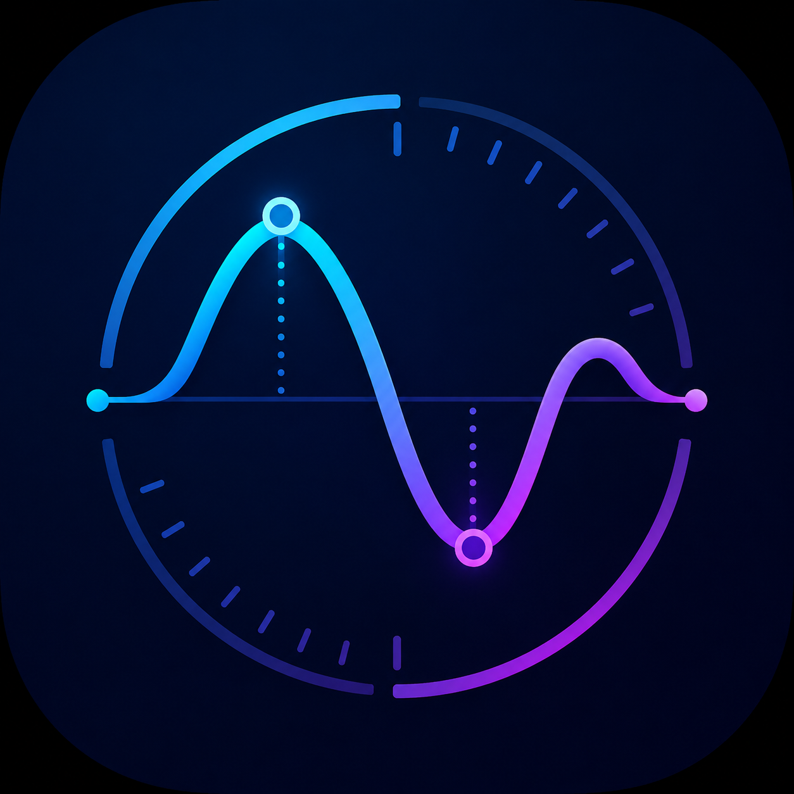
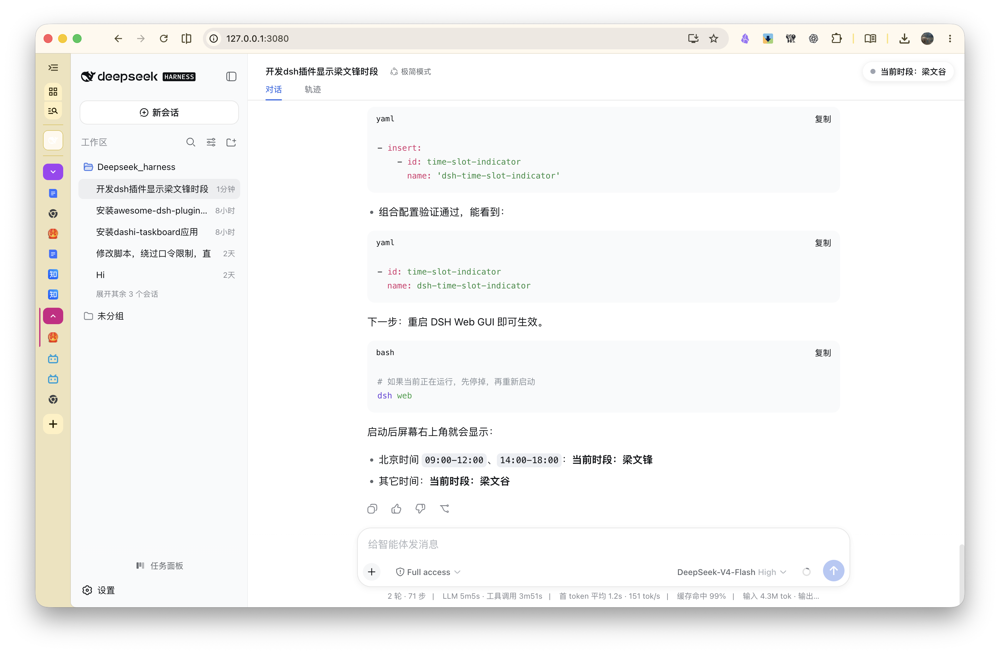

# 梁文峰谷

> 一个会看时间的 DSH 插件。  
> 它蹲在屏幕右上角，帮你盯住 DeepSeek 算力错峰时段：  
> 梁文峰上班时它喊“梁文峰”，梁文峰下班它立刻改口“梁文谷”。  
> 比闹钟准时，比老板还关心你什么时候该用便宜算力。

## 这是什么

**梁文峰谷** 是一个 DeepSeek Harness (DSH) 客户端插件，会在 Web GUI 的右上角显示一个当前时段角标。

它不会打扰你，不会抢焦点，也不会偷偷用你的算力写小说。它只是安静地做一个时间提示器。

## 功能

- 北京时间 `09:00-12:00` 与 `14:00-18:00`：显示 **当前时段：梁文峰**
- 其它时间：显示 **当前时段：梁文谷**
- 使用 `Asia/Shanghai` 固定计算北京时间，不跟你浏览器的时区玩猜谜
- 每个分钟边界自动刷新，不用手动刷新页面
- 支持夜间模式，跟随 DSH 主题自动切换配色

## 预览





## 安装到本机 DSH

```bash
cd liangwenfeng-gu
./install-real-profile.sh
```

脚本会把插件以 `link:` 方式加入 `~/.dsh/profiles/web`，并在 `cordis.patch.yml` 追加插件条目。重启 `dsh web` 后生效。

## 手动构建

```bash
npm install
npm run build
npm test
```

## 开源

本项目使用 MIT License 开源。  
欢迎提 issue、提 PR、或者给它写一首诗。
