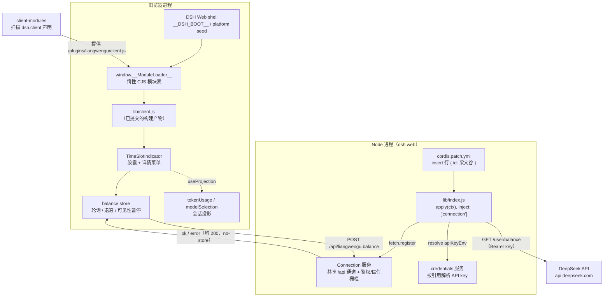
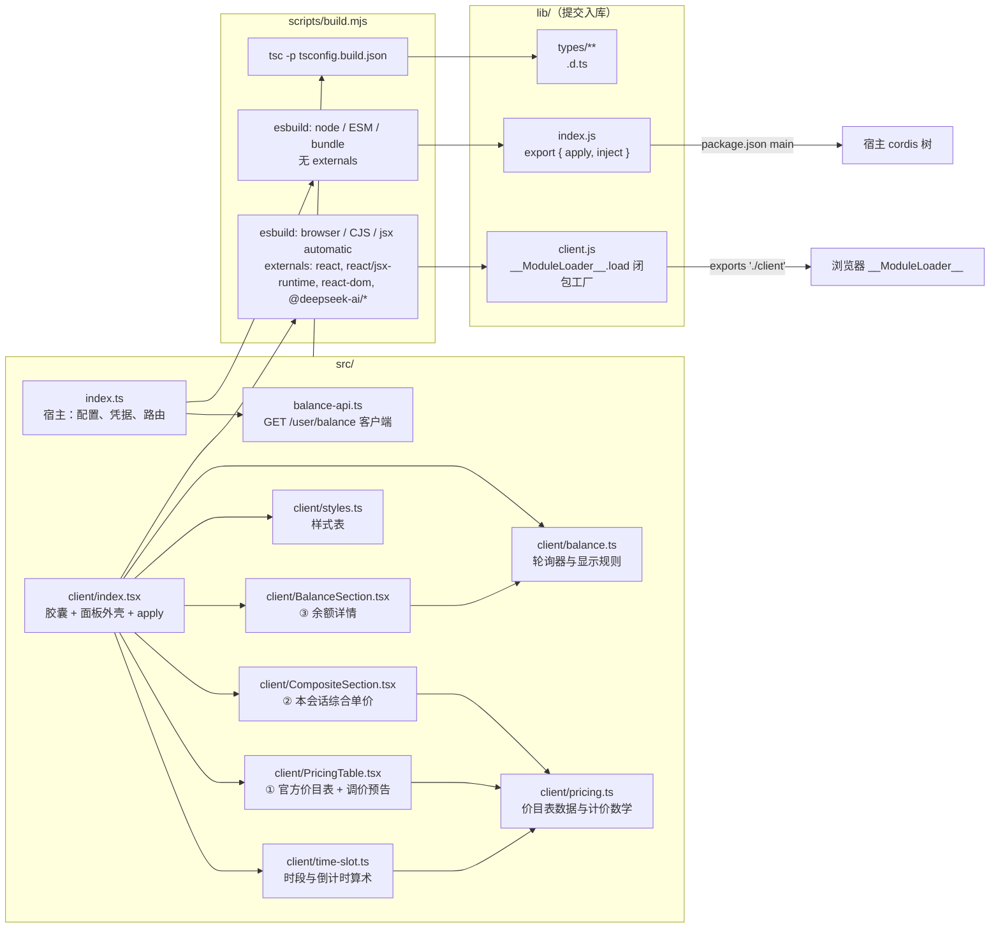
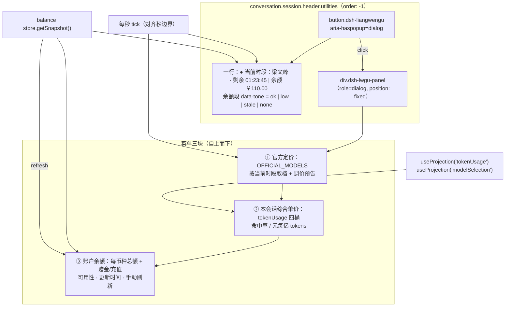
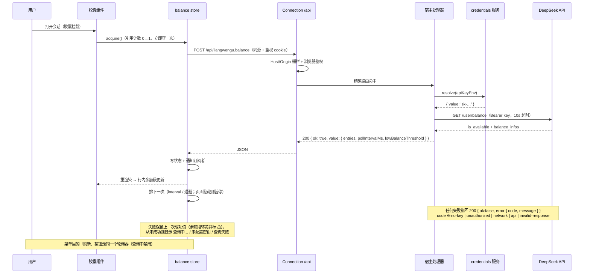

# 梁文谷 — 实现架构

一个 DSH Web 客户端插件，同时有宿主（Node）半侧与浏览器半侧。宿主半侧只做一件事：把 DeepSeek 账户余额安全地送到浏览器；浏览器半侧渲染胶囊（时段 / 倒计时 / 余额）与点击展开的详情菜单（官方价目表 → 本会话综合单价 → 余额详情）。

## 0. 一页速览

```
┌─ 浏览器 ─────────────────────────────────────────────────────────────┐
│  DSH Web shell                                                       │
│   window.__ModuleLoader__.load({ id: 'liangwengu', factory })        │
│            │ platform seed（react / react/jsx-runtime）               │
│            ▼                                                         │
│   lib/client.js  ── apply(ctx) ──► ctx.slots.register(...)           │
│            │                          │                              │
│            │                          ▼                              │
│            │            conversation.session.header.utilities        │
│            │              └─ TimeSlotIndicator（胶囊 + 详情菜单）     │
│            │                     ├─ 每秒 tick：时段 / 倒计时         │
│            │                     ├─ tokenUsage / modelSelection 投影 │
│            │                     └─ balance store（轮询器）           │
│            ▼                                                         │
│   POST /api/liangwengu.balance  （同源，带浏览器鉴权 cookie）         │
└──────────────────────────────┬───────────────────────────────────────┘
                               │ Connection 的共享 /api 通道
┌─ Node（dsh web 进程）────────▼───────────────────────────────────────┐
│  cordis 树（profile bundles + cordis.patch.yml 组合）                │
│    └─ 行 { id: 梁文谷, name: liangwengu }                            │
│         └─ lib/index.js  apply(ctx)  inject: ['connection']          │
│              └─ connection.fetch.register({                          │
│                   path: '/api/liangwengu.balance', methods: ['POST']})│
│                    │ 凭据服务按引用解析 key（回落 process.env）       │
│                    ▼                                                 │
│              GET https://api.deepseek.com/user/balance               │
│                    │                                                 │
│              { ok: true, value: { isAvailable, entries,              │
│                                   pollIntervalMs, lowBalance… } }    │
└──────────────────────────────────────────────────────────────────────┘
```

三条不变量贯穿全图：

1. **API key 永不出宿主**：浏览器只知道同源路由，key 由宿主每次请求时按引用解析。
2. **浏览器半侧零运行时依赖**：bundle 只 `require('react')` 与 `require('react/jsx-runtime')`，其余全部内联或 type-only。
3. **`lib/` 即产物**：仓库提交构建产物，CI 用 `git diff --exit-code -- lib` 防漂移。

## 1. 运行拓扑（进程与契约边界）



要点：

- 宿主半侧注册的是 **Connection 上的精确 Fetch 路由**（不是 `connection.rpc.handle`）：共享 `/api` 载体会先做 Host/Origin 栅栏与浏览器鉴权，再进处理器。
- 路由路径是本插件私有的 `/api/liangwengu.balance`：Connection 对重复的精确路由直接抛错，用私有路径才能与 `dsh-deepseek-balance` 同时安装。
- 宿主半侧声明 `inject: ['connection']`，没有该服务的 profile（headless）不会激活它，浏览器半侧照常加载（余额行显示「查询失败」）。

## 2. 模块与构建



`package.json` 的四个消费契约：

| 字段 | 值 | 消费方 |
| --- | --- | --- |
| `main` / `exports["."]` | `lib/index.js` + `lib/types/index.d.ts` | 宿主 cordis Loader |
| `exports["./client"]` | `lib/client.js` | client-modules 的 bundle 路由 |
| `dsh.client.platform` | `web` | client-modules 扫描 |
| `dsh.bundle.patch` | `./cordis.patch.yml` | `dsh plugin add` / profile 组合 |

两个半侧的生效方式不同：宿主半侧 `lib/index.js` 在 `dsh web` 启动时导入一次（改完要重启进程），浏览器半侧由 client-modules 每次从磁盘读给页面（刷新即可）。正因为生效时机不同，构建时会给两个半侧注入同一枚 `__LWGU_STAMP__`（`src/` 的源码指纹），宿主在每次响应里带上它——但指纹只用于**比对**：两侧不一致时菜单才多出一条提示，一致时界面里没有任何构建字段。否则「新前端 + 旧后端」只会表现为一个费解的 404。

## 3. 客户端组件与数据流



菜单的可访问性行为：`role="dialog"` 的**非模态**面板（页面其余部分仍可用，点击外部即关），因此不设 `aria-modal`、也不锁焦点；但打开时焦点会移入面板（`tabIndex={-1}`，`visibility: hidden` 期间无法聚焦，故等定位那一帧之后再聚焦），关闭时归还给打开它的元素——否则键盘用户得先 Tab 穿过整页才能碰到模型行与刷新按钮。

时序（一次余额轮询）：



## 4. 目录职责

| 路径 | 职责 |
| --- | --- |
| `src/index.ts` | 宿主半侧：配置解析与钳制、凭据解析（服务→环境变量）、注册 `/api/liangwengu.balance`、合并窗口、把快照与生效配置一起下发 |
| `src/balance-api.ts` | `GET /user/balance` 的请求、解析、错误分类；纯函数，可脱离网络测试 |
| `src/client/index.tsx` | 胶囊渲染、面板外壳（定位 / 焦点 / 关闭）、`apply` 注册槽位、测试用再导出 |
| `src/client/time-slot.ts` | 北京时间峰谷判定、剩余时间与倒计时格式化（纯算术，无 Intl） |
| `src/client/pricing.ts` | 官方价目表数据（按生效时间分档）、计价数学、档位标签 |
| `src/client/PricingTable.tsx` | 菜单第一块：价目表与调价预告（`memo`，只随档位 / 生效分档 / 选中模型变化） |
| `src/client/CompositeSection.tsx` | 菜单第二块：本会话综合单价（`memo`） |
| `src/client/BalanceSection.tsx` | 菜单第三块：余额详情与手动刷新（`memo`） |
| `src/client/balance.ts` | 引用计数轮询器（退避、抖动、可见性暂停、失败保留旧值）与余额显示规则 |
| `src/client/styles.ts` | 样式表（DSW token + 兜底色，跟随 `body[data-ds-dark-theme]`） |
| `scripts/build.mjs` | 两个半侧的 esbuild 打包 + `tsc` 出 `.d.ts` |
| `cordis.patch.yml` | 把宿主行插进 profile 组合树（`name` 必须是包名，Node 解析才能找到） |
| `lib/**` | 提交入库的构建产物：`index.js` / `client.js` / `types/**` |
| `test/*.mjs` | 全部加载构建产物：时段、计价、余额状态机、宿主路由契约、jsdom 真实渲染；`react-stub.mjs` 是给不渲染的用例共用的 react 桩 |

## 5. 兼容性与契约面

插件消费的 DSH 契约面（`dsh-v0.1.3-alpha.1` ~ `dsh-v0.1.5-rc.1` 上逐字一致）：

| 契约 | 用途 |
| --- | --- |
| `dsh.client` 声明 + `window.__ModuleLoader__.load({ id, factory })` | 浏览器半侧被加载 |
| `ctx.slots.inject / register`（`{ name, id, order }`） | 胶囊挂到会话标题栏 utilities 槽 |
| `PropsRuntime<'conversation.session.header.utilities'>` 的 `useProjection` / `sessionId` | 读会话投影 |
| `@deepseek-ai/dsh-token-meter/client` 的 `tokenUsage` 四桶 | 综合单价 |
| `@deepseek-ai/dsh-api-session-controller/types` 的 `modelSelection` | 默认计价模型 |
| `connection.fetch.register({ path, methods, requestBody, fetch })` | 宿主余额通道 |
| `ctx.get('credentials').resolve(ref)` | API key 解析（与模型适配器同一条链） |
| `@deepseek-ai/cordis` 4.0.2 | `Context` / `Service` / fiber 生命周期 |

放弃兼容与后续策略见 [README「兼容性」](../README.md#兼容性)。
